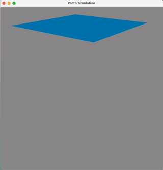
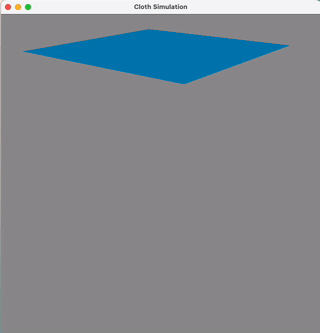

# Fast-Mass-Spring

Mass-spring systems are a fundamental concept in computer graphics and physics simulations, with applications ranging from animation and video games to engineering and scientific modeling. The paper "[Fast Simulation of Mass-Spring Systems](https://users.cs.utah.edu/~ladislav/liu13fast/liu13fast.html)" presents innovative techniques that promise to revolutionize the efficiency of simulating these systems.

This repository is based on [FastMassSpring](https://github.com/sam007961/FastMassSpring), replacing the `glut` with `glew`.

## Getting Started

1. **Clone the Repository**: Start by cloning this repository to your local machine.

   ```bash
   git clone https://github.com/liumu96/Fast-Mass-Spring
   cd Fast-Mass-Spring
   ```

2. **Build**: Only tested in Mac M2.

   ```bash
   cd Fast-Mass-Spring
   mkdir build && cd build
   cmake ..
   make
   ```

3. **Run**: Press `W` to `run` the program
   ```bash
   ./fast-mass-spring
   ```

## Dependencies

- OpenGL, GLFW, GLEW, GLM for rendering.
- OpenMesh for computing normals.
- Eigen for sparse matrix algebra

## Algorithms

---

1. Build Mesh : vertices → faces
2. Build Spring System: build grid
3. Solver:
   1. precompute system matrix
   2. iterations:
   - fix x → solve the optimal d (local)
   - fix d → solve the optima x (global)

---

## The Notes


## Results




## References

[1] Liu, T., Bargteil, A. W., Obrien, J. F., & Kavan, L. (2013). Fast simulation of mass-spring systems. ACM Transactions on Graphics,32(6), 1-7. doi:10.1145/2508363.2508406

[2] Ladislav Kavan: Physics-based Animation : Fast Mass Simulation
[youtube](https://www.youtube.com/watch?v=Q0D3tUViO6Y&list=PL_a9tY9IhJuM2dIVCH_ZC0Pn5871eDY7_&index=1&ab_channel=LadislavKavan)
